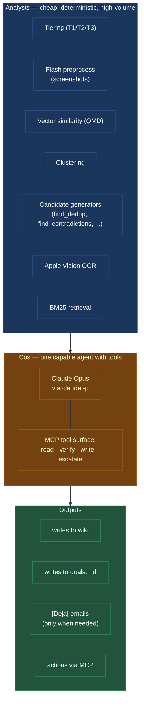
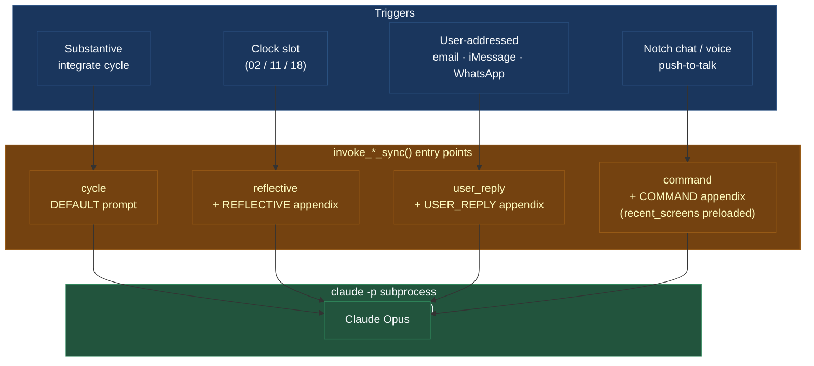
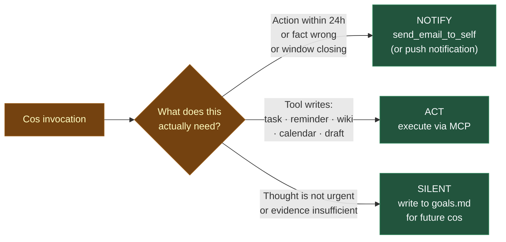
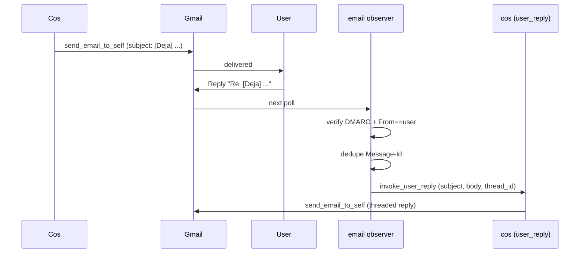

# Chief of Staff

Cos is Deja's decision layer. Everything else — the tiering, the screenshot preprocess, the vector similarity, the candidate generators — is cheap analyst work preparing material for cos.

## Why this shape

Analysts are good at mechanical, narrow work: "here are 40 pairs of pages above 0.82 cosine similarity" or "this screenshot has 820 characters of OCR, condense or skip." They're terrible at "which of these pairs is actually the same person" — that's a judgment call, and it requires disambiguation against real-world evidence.

Cos doesn't need to be cheap because it runs rarely. It runs:

- After a **substantive integrate cycle** — maybe a dozen times a day.
- At **three reflect slots** (02 / 11 / 18 local) — three times a day.
- On **user-initiated commands** — voice, notch chat, self-addressed email or iMessage.

Maybe thirty to fifty Claude Opus calls per day total. That's cheap at current prices, and each call is worth it because cos is the one filtering what reaches you.

## Four invocation modes

Every cos invocation is a fresh `claude -p` subprocess with the Deja MCP attached and a 10-minute hard timeout. What changes is the trigger and the appendix to cos's system prompt.

| Mode | Trigger | Payload |
| ---- | ------- | ------- |
| `cycle` | After a substantive integrate cycle | cycle_id, narrative, wiki update slugs, goal changes count, due reminders count, new T1 signals |
| `reflective` | Clock slot (runs inside `run_reflection`) | slot, horizon, timestamp |
| `user_reply` | Self-addressed email / iMessage / WhatsApp | subject, user message, thread_id, in_reply_to, conversation slug |
| `command` | Notch chat or voice push-to-talk | user message, source, conversation slug, recent_screens, timestamp |

Command mode also preloads `recent_screens` — per-display OCR plus AX frontmost-window metadata — so cos can ground pronouns like "this email" or "that person" when you're verifiably at your computer.

## Disposition: NOTIFY · ACT · SILENT

Every invocation picks one of three dispositions.

- **NOTIFY** is reserved for three cases: an action needed within ~24 hours that the user isn't already handling; a fact the user believes is wrong or just changed; a live opportunity that's about to close.
- **ACT** is any tool write — add a task, add a reminder, update the wiki, draft an email, create a calendar event, complete a task. Actions leave a trail in `audit.jsonl`.
- **SILENT** is the default. A day with no email is healthy. If cos has a thought that isn't urgent, it writes it to `goals.md` and future cos cycles decide when to surface it.

The disposition is **filter, don't plan**. Goals.md is cos's scratchpad. There's no fixed digest schedule; timing is itself a reasoning task. Monday morning is often the right time to surface something noticed Friday afternoon.

## Cos reasons over time

Each cos invocation is a fresh subprocess — no in-process memory. But cos is **stateful across time via its writes**:

- **`goals.md`** is the scratchpad. Cos writes items; future cos cycles read them and decide whether to act.
- **The wiki** is durable facts cos updated; future cos retrieves them for context.
- **`~/Deja/conversations/<date>/<slug>.md`** is one file per user↔cos conversation thread. Indexed by the same QMD catalog as events; retrievable via MCP.

So cos can plant a thought now and revisit it later. A future cos reads what a prior cos wrote. This is the mechanism for getting more useful over time.

!!! example "Plant-and-revisit in practice"
    Friday 4 PM: an email arrives about a conference talk proposal due in two weeks. Cos notices, but it's Friday afternoon, the user is mid-coordination on unrelated work, and the deadline isn't imminent. Cos adds a reminder line to `goals.md` surfaced for Monday morning. Monday 11 AM reflect slot: cos sees the reminder, checks recent activity to see if the user has already started, and either prompts or lets it slide another day.

## The user reply channel {: #user-reply }

When cos emails you and you reply, that reply comes back in as a first-class message. Works from your phone because it's email — no vision dependency, no local hook.

A couple of details matter:

- **Anti-spoofing is strict.** The parsed `From` must exactly match your authenticated Google identity, and Gmail's `Authentication-Results` header must show `dmarc=pass`. Rejections are audited.
- **Feedback loops are prevented.** Cos's outbound emails (subject starts with `[Deja]`, not `Re:`) are dropped by the observer. Only replies come back in.
- **Threading is preserved.** Cos replies with `in_reply_to` and `thread_id` set, so Gmail collapses the thread cleanly.

You can also reply by sending yourself an iMessage or WhatsApp message with `[Deja]` in the content. Same path — self-addressed, routed to `invoke_user_reply`, conversation logged under `~/Deja/conversations/`.

## Cos state on disk

The `chief_of_staff/` directory under `~/.deja/`:

| File | Purpose |
| ---- | ------- |
| `enabled` | Empty marker. Presence turns cos on. `deja cos enable/disable` toggles this. |
| `system_prompt.md` | Editable copy of the default cos system prompt. |
| `mcp_config.json` | MCP server config for the Claude subprocess. |
| `invocations.jsonl` | Log of every cos call — payload, return code, stdout, stderr. |
| `processed_replies` | One Message-Id per line; dedupes the email reply channel. |

`deja cos tail` streams the invocations log live. Very useful when you're watching cos make decisions in real time.

## When to add a new cos capability

The rule of thumb: if you're tempted to add a narrow LLM sweep somewhere — "let's have Flash classify these events as X or Y" — the right move is almost always:

1. Add a **deterministic candidate generator** (analyst layer).
2. Expose it as an **MCP tool** so cos can decide.

Integrate is the exception: it's immediate, bounded, and its prompt is load-bearing. Reflect is explicitly designed around cos-makes-the-call. New judgment logic almost always belongs on cos's side of the fence.
