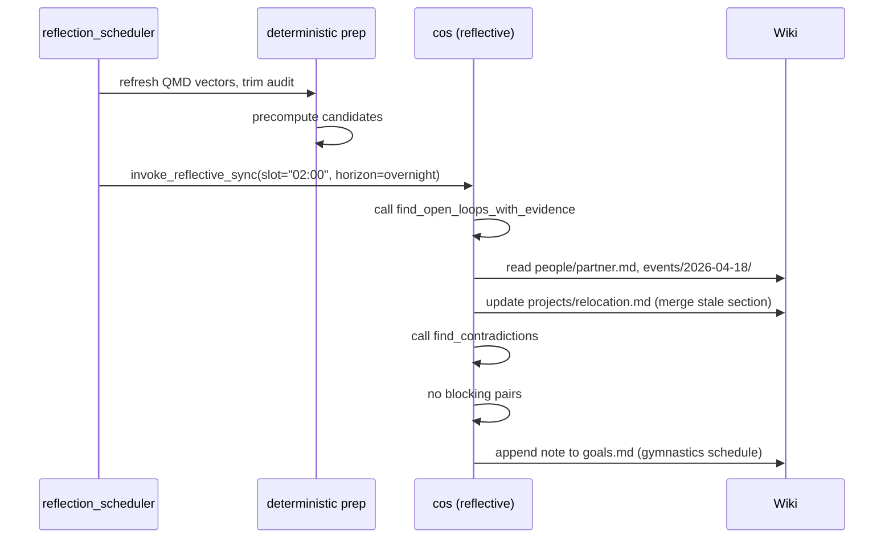
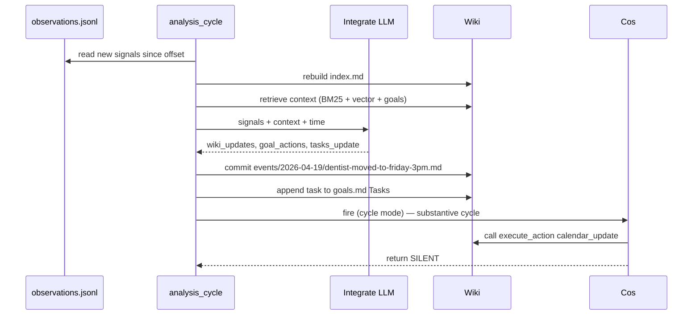
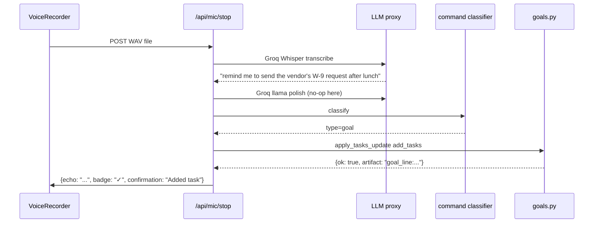
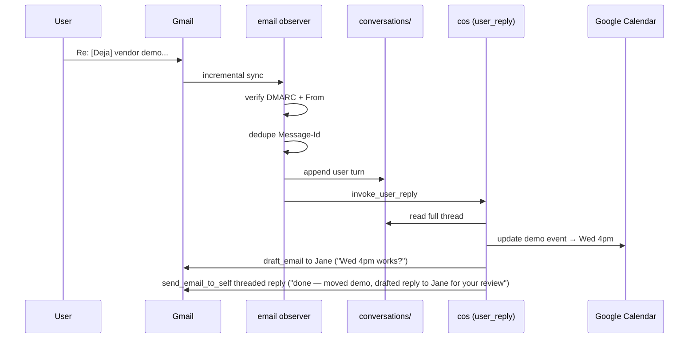

# A day in the life

The cleanest way to understand Deja is to watch a day. The cast is a hypothetical product person — call them **Alex**. Alex has a partner (role tag: `partner`), a kid on a gymnastics team (coach tag: `coach`), a running project at work (`project:relocation`), and a recent intro call with a vendor (`contact:jane-pm`).

Every interaction below is grounded in a specific pipeline, a specific cos mode, and a specific wiki write.

## 07:32 · morning reflect

Alex's Mac wakes. The reflect scheduler notices that the 02:00 slot was missed (Mac was asleep) and the 11:00 slot isn't due yet. It picks one slot — the most recent missed one — and fires.



Two things happen in the wiki:

- A stale section in `projects/relocation.md` gets cleaned up. Cos calls `find_dedup_candidates` on projects, sees that `projects/relocation.md` and `projects/office-move.md` score 0.89 similarity, reads both pages, cross-references with `search_deja`, and decides they're the same arc. It merges via `update_wiki`, with a reason citing the two events that tied them together.
- Cos notices that the coach sent a schedule change on Friday evening that Alex hasn't acted on. The deadline isn't imminent — the new practice time is next Wednesday. Cos writes a reminder line to `goals.md` surfaced for Monday morning:
  ```text
  [2026-04-21] gymnastics Wed practice moved to 5:30pm → [[gymnastics-team]]
  ```

Cos stays silent. No email, no notification. A day with no email is healthy.

## 08:10 · iMessage thread lands

Alex's partner texts: "don't forget the dentist is moved to 3 on Friday." Two observations land in `observations.jsonl` within a second of each other — the original message, and a follow-up ("also they called about insurance").

The observe loop dedupes by `id_key`, tiers both as T1 (inner-circle inbound), attaches the last 30 messages of thread context, and persists.

Five minutes later the integrate cycle fires:



The integrate LLM emits:

- A new event page at `events/2026-04-19/dentist-moved-to-friday-3pm.md` with `partner` in the people frontmatter.
- A `tasks_update` with `add_tasks: ["Move dentist cal event to Friday 3pm"]`.
- An `observation_narrative`: "Partner confirmed dentist moved to Fri 3pm; insurance call pending."

Cos is fired in cycle mode. It reads the narrative, sees the task, checks `calendar_list_events` to find the existing dentist event, and calls `execute_action("calendar_update", {event_id: "...", start: "2026-04-24T15:00:00"})`. It marks the task complete in `goals.md` with a reason line. Cos's disposition: **SILENT**. No email — the user already knows, and cos just handled the mechanical piece.

The only visible result on Alex's side is that when they open the Calendar app later, the event is at 3pm instead of 2pm.

## 10:45 · a command through voice

Alex is walking to a meeting, holds Option, and says: "remind me to send the vendor's W-9 request after lunch."

Voice capture runs in the Swift process. On release, the WAV is sent to the web backend:



The echo pill pops onto the screen for three seconds: `✓ remind me to send the vendor's W-9...` with an **undo** button visible for five.

Alex doesn't undo. The task is in `goals.md`.

A minute later, walking into the conference room, Alex holds Option again and says: "what did Jane from the vendor say about pricing last week?" This classifies as `query`. The query handler synthesizes from the wiki (`people/jane-pm.md`, relevant events) + goals + recent activity and returns a short answer in the notch. No wiki write, no cos invocation — just a retrieval.

## 13:15 · notch chat for context

Alex opens the notch panel (click the menubar icon) and types: "note that the vendor quoted $4,200/month with 90 days of onboarding." This classifies as `context`.

The dispatcher appends a synthetic observation to `observations.jsonl` with source `typed` and the full text, then writes `~/.deja/integrate_trigger.json` — which wakes the integrate loop ahead of its next 5-minute slot.

Integrate fires. The LLM promotes this to a durable fact on `people/jane-pm.md` and `projects/relocation.md` (Rule 9: durable facts get promoted to the entity body). A new event page is materialized: `events/2026-04-19/vendor-quote-4200.md`.

No cos call — it wasn't a substantive-enough cycle to fire cos, and there's nothing to decide yet.

## 14:30 · an email cos needs to handle

A vendor confirms a demo call for Tuesday. The email lands in Gmail and the observe loop picks it up (~6s after delivery).

Five minutes later integrate fires. It creates an event page and, because `goals.md ## Automations` contains a rule — "when a demo call is confirmed, create a calendar event and block 15 minutes of prep time" — it emits a `goal_action`:

```json
{
  "type": "calendar_create",
  "params": {
    "summary": "Demo — Jane's vendor",
    "start": "2026-04-23T16:00:00",
    "end": "2026-04-23T16:45:00",
    "kind": "firm"
  },
  "reason": "demo confirmed by Jane 2026-04-19"
}
```

Integrate runs the executor, inserts the calendar event, and then fires cos in cycle mode.

Cos reads the narrative, sees the new event, cross-references `calendar_list_events` for conflicts. There's a potential conflict — a standing 1:1 at 4pm on Tuesdays. Cos picks **NOTIFY**: this needs the user to decide, it's within the 24h-ish window, and the call window is closing (vendor expected a time back soon).

```json
{
  "type": "send_email_to_self",
  "params": {
    "subject": "[Deja] vendor demo Tuesday 4pm conflicts with weekly 1:1",
    "body": "Jane's vendor confirmed Tuesday 4pm for the demo. That's your standing 1:1 with Pat.\n\nOptions I see:\n- Reschedule the 1:1 to Wed morning (Pat usually has Wed open).\n- Push the demo to Weds 4pm (you have a hold that could move).\n- Keep the 1:1 short and take the demo right after.\n\nReply to this email with what you want me to do."
  },
  "reason": "demo confirmed but conflicts with weekly 1:1; needs user decision"
}
```

Alex is in a meeting. The email lands on their phone.

## 15:02 · reply from the phone

From the phone: "do option 2, push demo to weds 4pm, and tell Jane."

That reply comes back via the email observer. Anti-spoofing passes (Gmail confirms DMARC + exact `From:` match). The message is de-duped by `Message-Id`, logged to `~/Deja/conversations/2026-04-19/deja-vendor-demo-conflict.md`, and dropped from the normal observation stream. Then cos is fired in **user_reply** mode.



Cos's reply threads cleanly in Gmail:

> **Re: [Deja] vendor demo Tuesday 4pm conflicts with weekly 1:1**
> Moved the demo to Wed 4pm. Drafted a reply to Jane asking if Wed works — it's sitting in your Drafts, review and send when you have a sec.

Alex will see that in Gmail whenever they check.

## 22:40 · evening memo to self

Alex, winding down, sends themselves an iMessage: "[Deja] remember to think about whether we actually need two vendors for Q3 — can probably consolidate."

Self-addressed messages with `[Deja]` route to cos as a **user_reply** (same as self-email, just different channel).

Cos reads it. This isn't actionable now; it's a thought worth returning to. Cos appends it to `goals.md ## Standing context` as a question the user is carrying, with a surface date of next Monday:

```text
- [2026-04-22] Revisit: do we actually need two vendors for Q3? User leaning toward consolidate.
```

No notification, no email. Future reflect passes will see the note and — if relevant signals come in over the weekend — cos can bring it up Monday morning.

## Late-night · integrate cycle with a screenshot

At 23:45 Alex is on a news site. Screen focus change triggers a capture. Apple Vision OCR runs on-device. The OCR yields 620 characters — above the 400-char preprocess gate — so Gemini Flash-Lite is called to condense:

```text
TYPE: news article
WHAT: quarterly results of a competing company, pricing and headcount
SALIENT_FACTS:
- competitor grew customer count 40% YoY
- average contract size up 12%
- ARR at ~$180M
```

That condensed block goes to `observations.jsonl` tagged T3 (ambient browsing). Next integrate cycle, the LLM sees it. There's nothing in the wiki that this attaches to cleanly, so integrate creates a minimal event page under `events/2026-04-19/competitor-q1-earnings.md` and leaves it at that.

Cos isn't fired; the cycle wasn't substantive enough. But the event page is now findable via `search_deja` the next time Alex asks "how are our competitors doing?" at the notch chat.

## The pattern

Every loop in the day is the same pattern repeated at different scales:

1. A signal arrives.
2. It's observed, deduped, tiered, persisted.
3. At some cadence (5 min, 3×/day, or on-command), an LLM reads it.
4. The LLM either writes to the wiki, fires an action, or stays silent.
5. Cos — if invoked — filters what gets to you.

The goal isn't volume of activity. The goal is that by the end of the day, the wiki knows a little more than it did this morning, a handful of small things got quietly handled, and exactly one thing that genuinely needed you bounced through your inbox and back.
