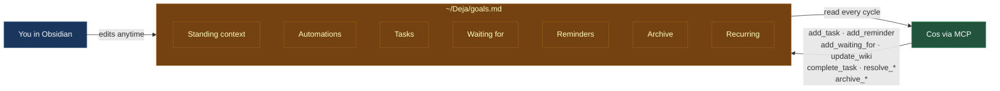

# `goals.md` — the working ledger

Everything cos does for you, it does against a single markdown file: `~/Deja/goals.md`. It's where your operating rules live, where cos plants things it's considering, and where both of you can push and pull at the same document without stepping on each other. If the wiki is the agent's long-term memory, `goals.md` is its working memory — the thing it consults every invocation and writes to more than any other file.

!!! tip "If you only read one page to understand how cos behaves, it should be this one."
    The way cos picks what to notify you about, what to silently handle, and what to ignore is almost entirely shaped by what's in `goals.md`.

## The shape

A single file, seven sections. Each section is edited by both you (in Obsidian) and cos (via MCP tools), though different sections lean more one way or the other.



## Standing context

Durable rules that shape every cos decision. These change rarely — weeks or months, not days — and cos treats them as first-class guidance.

```markdown
## Standing context

- Joe drives carpool Monday and Wednesday. Jane drives Tuesday and Thursday.
- Pool chlorine should be checked weekly. Flag if it's been more than 7 days.
- User starts at <company> on 2026-04-20. Onboarding and relocation are high priority.
- When a Tuesday conflict surfaces, the younger kid's activity wins.
```

**Who writes:** primarily you. Cos can propose additions when it catches a recurring pattern across cycles (e.g., "user always replies to co-parent within an hour — propose adding a rule"), but it surfaces these as proposals rather than writing them silently.

**How cos uses it:** loaded into every invocation's system prompt. When cos decides "should I bother the user?" it checks standing context first — if your rules say "don't surface carpool changes before Sunday evening," cos honors that over its own "act now" instinct.

## Automations

Trigger → action rules that cos executes on a cadence or signal.

```markdown
## Automations

- **TeamSnap → Calendar**: When a TeamSnap email arrives with a new/updated
  practice or game, create a Google Calendar event. Include both kids' teams;
  flag conflicts in the Sunday evening reflective pass.
- **Notify before meetings**: 1 hour before a calendar event with someone
  in the wiki, notify with a 1-line context summary.
- **Daily podcast digest**: On the morning reflective pass, call
  `browser_ask` to pull recent Spotify Recently Played, save a short
  wiki note under `events/<date>/<podcast>-<episode-slug>`. Don't email
  — ambient context that makes follow-ups smarter.
- **Slack watch**: Every few hours, browser_ask Slack DMs with Joe and
  Jane. If actionable, add a task or waiting-for; if status, update
  the project page. Email only if genuinely urgent.
```

**Who writes:** both. You can hand-write an automation in Obsidian and cos will respect it. Cos also proposes new automations when it notices itself doing the same reasoning across weeks — "every Sunday I pull the sports schedule and propose drivers" is the kind of pattern that gets promoted into a rule here with evidence cited in the audit trail.

**How cos uses it:** scanned every reflective pass. Each automation is matched against the current horizon — "morning pass, is this a morning-slot automation?" — and fired when conditions line up.

## Tasks

Things you've committed to doing yourself.

```markdown
## Tasks

- [ ] Finish and ship <project> before start date
- [ ] Reply to Joe about <thread>
- [x] Wire back the deposit — confirmed 2026-04-18
- [x] Review and send draft email to Jane re: interview follow-up
```

**Who writes:** both. You add tasks in Obsidian when you commit to something. Cos adds tasks when it sees you commit in an outbound email or message ("I'll send the deck by Friday" → `add_task`). Either of you can check them off; cos also closes them via `complete_task` when it sees evidence of completion in later signals.

**How cos uses it:** reviewed every cycle. Due-today and approaching-deadline items are candidates for notification. Cos also auto-resolves tasks when new signals prove they're already done, to keep the ledger honest.

## Waiting for

Things other people owe you.

```markdown
## Waiting for

- [ ] **Jane Doe** — feedback on draft before we ship (so we can publish live)
- [ ] **Joe Smith** — builder contact for garage project (added 2026-04-13)
- [x] **Acme Recruiter** — registration code for next conference
- [x] **Billing vendor** — confirmation that distribution wire was sent
```

**Who writes:** both. You add when you know someone owes you something. Cos adds when it sees promises in messages addressed to you ("I'll get back to you next week" → `add_waiting_for` tagged with the person). Cos resolves (directly or by chain of evidence — if Joe promised you Jane's contact and Jane emails you, that satisfies Joe's waiting-for).

**How cos uses it:** the most actionable section for "follow-up" decisions. If a waiting-for is past its expected date, cos can draft a nudge email for you to review. The `find_open_loops_with_evidence` MCP tool sweeps this section against recent events to detect indirect satisfaction.

## Reminders

Date-tagged nudges cos will surface on or after a specific date. Format: `[YYYY-MM-DD]`.

```markdown
## Reminders

- [2026-05-08] Did Joe send the demo? Check back if silent.
  → [[joe-smith]], [[project-x]]
- [2026-04-22] Did the dev server bind fix actually get committed?
  Flagged 2026-04-18 but still uncommitted. → [[tru-project]]
- [2026-05-06] Did user put on the parked position before earnings?
  Venue + trading-window considerations worth a quick think.
```

**Who writes:** both. You add via `/remind` in the notch or "remind me in a week..." by voice. Cos adds future-dated checkpoints when it's not sure a thread has resolved ("close of business next Monday, check if we got an answer"). Topic tags at the end help cos route reminders to the right cycle context.

**How cos uses it:** reviewed every cycle. When a reminder's date is today or past, cos re-evaluates whether it's still relevant — signals may have already resolved the concern. If so, cos auto-resolves via `resolve_reminder`. Otherwise it surfaces as a nudge at the appropriate moment of day.

## Archive

Resolved items with their resolution reasons and timestamps. Never gets re-read for decisions — it's for you and for debugging.

```markdown
## Archive

- [2026-04-14] Run the blind shadow eval for integrate-model comparison.
  → [[deja]] — archived 2026-04-16: superseded by Claude Vision adoption.
- [x] Pick up the kid from gym tonight — archived 2026-04-16: past date.
- [x] Schedule chat with Joe before start date — archived 2026-04-17:
  completed.
```

**Who writes:** cos, mostly. When you check off a task or cos resolves a waiting-for/reminder, the item moves here with a one-line reason. Keeping this makes the file honest: you can see exactly why cos closed something.

## Recurring

Sweeps that fire on schedule, not in response to signals.

```markdown
## Recurring

- **Sunday night**: Confirm carpool plan is set for the upcoming week
  with co-parent.
- **Weekly**: Flag if pool chlorine hasn't been checked in 7+ days.
- **Daily**: Surface any tasks approaching their deadline.
```

**Who writes:** both. Similar to Automations but simpler — time-based rather than trigger-based.

**How cos uses it:** the reflective-pass handler checks these against the current slot (morning / midday / evening) and fires the ones due.

## Why this file matters

1. **Persistence across invocations.** Every cos invocation is a fresh Claude subprocess. It doesn't remember the last one. But it reads `goals.md` at the start, so whatever the previous cos wrote into this file is available to the next one. This is how cos reasons over time: by writing notes to its future self.

2. **Transparent agent behavior.** You can see exactly what cos is tracking. If it's surfacing the wrong thing, the line is right there in Obsidian — delete it, edit it, add a standing rule to say "don't do this." No opaque vector stores, no hidden state.

3. **Codifying patterns without retraining.** When cos catches itself doing the same reasoning twice — "I always check Slack for messages from Joe and Jane before surfacing a new thread" — you can promote that into an Automation. No code change, no prompt-engineering session. It's in the ledger, cos reads it next cycle, done.

4. **Fallback for notification discipline.** Cos's default disposition is "add to goals.md rather than email." Something non-urgent that might matter later doesn't interrupt you — it goes in as a task or reminder, and a future cos cycle decides when (or if) to surface it. A schedule hint noted at 3pm Friday doesn't wake you up; cos plants it and surfaces it at Monday's morning pass if it's still relevant.

5. **Bidirectional source of truth.** You own this file. You can rewrite a task, delete an Automation you don't want, rearrange the whole Standing context section. Cos re-reads it next cycle and adjusts. It's not a queue cos processes once — it's a living document cos orbits.
