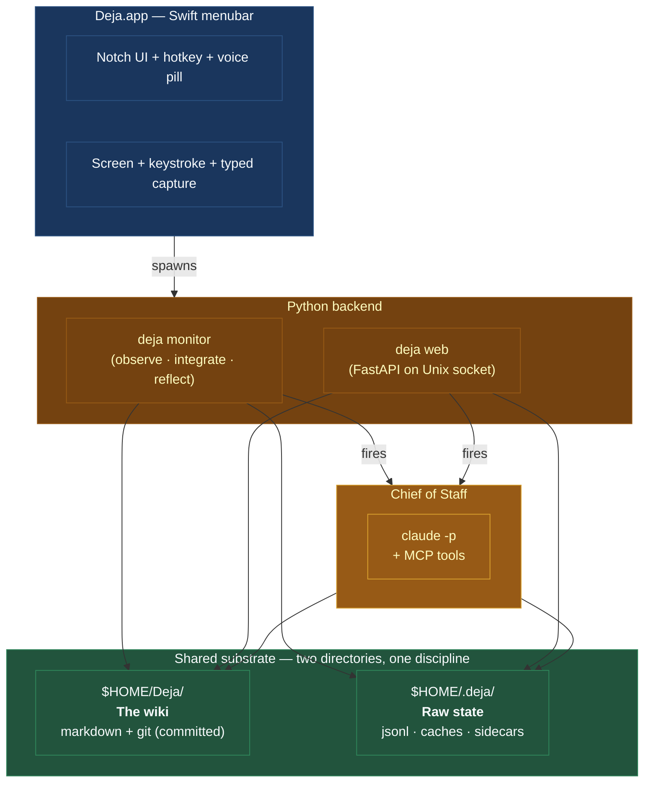

# What is Deja?

Deja is a personal chief of staff that runs on your Mac. It watches the [signals](signals.md) you already produce — email, iMessage, WhatsApp, screenshots, calendar, clipboard, browser, voice — and maintains a living [wiki](wiki.md) of the people, projects, and events that matter to you. On top of that wiki, a small agent named **[cos](cos.md)** decides when to nudge you, take action (draft a reply, create a calendar entry, close a loop), or stay silent.

The interesting part isn't any single capability. It's the shape of the system.

## A two-tier mental model

Everything below is either a consequence of that picture, or a choice about how the pieces cooperate.

- The **Swift menubar app** is the face: a notch-docked UI, the global hotkey, the voice pill, screen capture. It owns macOS integration and nothing else.
- The **Python backend** is two subprocesses — a monitor loop and a FastAPI web server. They share the same on-disk state.
- The **wiki** at `~/Deja/` is where Deja's memory lives: one Markdown file per person, per project, per event, all committed to a local git repo.
- **cos** is the decision layer. It's a fresh [Claude CLI](cos.md) subprocess spawned on demand, wired to the wiki and actions through an [MCP tool](mcp.md) surface.

### Two directories, one discipline

Deja splits storage into two places on purpose:

| | `~/Deja/` — **the wiki** | `~/.deja/` — **raw state** |
|---|---|---|
| **What** | People, projects, events, [`goals.md`](goals-file.md) | [Observations](signals.md) log, audit log, screenshot PNGs, OCR sidecars, caches, sockets, cos config |
| **Git?** | Yes, local repo. Every agent write is a commit with a `reason`. You can diff, revert, walk history. | No. It grows fast (thousands of JSONL lines + tens of MB of PNGs per day) and isn't meant to be reviewed entry-by-entry. |
| **Audience** | Human-readable. Open it in Obsidian. Share / publish / back up if you want. | Infrastructure. Caches and sidecars. Privacy floor — raw screenshots of in-flight work the wiki has already distilled away from. |
| **Reversibility** | `git revert` any bad write. | Append-only by design; nothing to reverse. Safe to throw away; most of it rebuilds from cursors. |

The split enforces a useful discipline: if something matters enough to reason about again, [integrate](pipelines.md#integrate) distills it into the wiki. If it's just raw signal, it stays under `.deja/`. You could delete `~/.deja/` tomorrow and the wiki would still carry everything Deja actually "knows."

## What shapes the design

Three commitments run through every choice in this system: it's **local-first** (raw data stays on your machine, network is only for LLM calls), **git-backed** (every agent write is a commit with a reason, so every mistake is reversible), and built around **trust over coverage** (cheap analysts sort, one capable agent judges, and most cycles produce silence). Those three — plus a handful of rules that fall out of them, like "filter, don't plan" and "silence is a legitimate output" — are written up in full on the [design principles](principles.md) page.

## Who this is for

You, if:

- You're comfortable running an app that reads your iMessage database and Gmail inbox.
- You want persistent memory across tools without giving up the local layer.
- You want something that *chooses not to speak* most of the time, rather than one more notifier.

## What's next

- **[Quickstart](quickstart.md)** — how to get Deja running on your Mac.
- **[The three pipelines](pipelines.md)** — Observe, Integrate, Reflect. Cadences and flow.
- **[Chief of Staff](cos.md)** — cos, the decision layer that ties it all together.
- **[Design principles](principles.md)** — the rules the rest of the system falls out of.

!!! note "This site is a teaching layer"
    If you want raw technical depth — file paths, line refs, regression guards — read `docs/ARCHITECTURE.md` in the repo. This site is the narrative.
