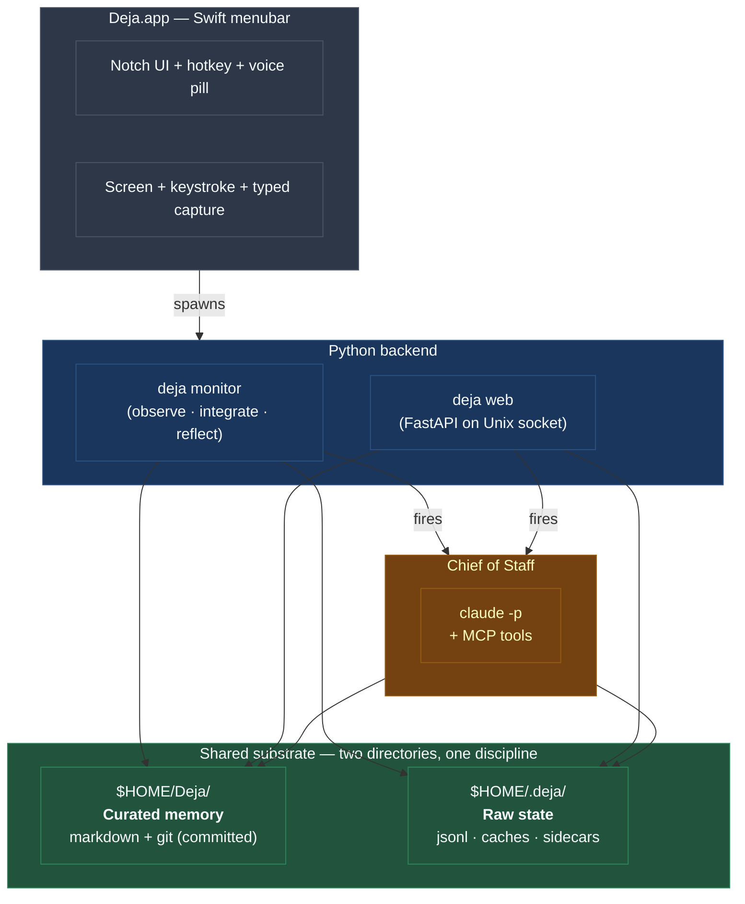

# What is Deja?

Deja is a personal chief of staff that runs on your Mac. It watches the signals you already produce — email, iMessage, WhatsApp, screenshots, calendar, clipboard, browser, voice — and maintains a living wiki of the people, projects, and events that matter to you. On top of that wiki, a small agent named **cos** (chief of staff) decides when to nudge you, take action (draft a reply, create a calendar entry, close a loop), or stay silent.

The interesting part isn't any single capability. It's the shape of the system.

## A two-tier mental model

Everything below is either a consequence of that picture, or a choice about how the pieces cooperate.

- The **Swift menubar app** is the face: a notch-docked UI, the global hotkey, the voice pill, screen capture. It owns macOS integration and nothing else.
- The **Python backend** is two subprocesses — a monitor loop and a FastAPI web server. They share the same on-disk state.
- The **wiki** at `~/Deja/` is where Deja's memory lives: one Markdown file per person, per project, per event, all committed to a local git repo.
- **Cos** is the decision layer. It's a fresh Claude subprocess spawned on demand, wired to the wiki and actions through an MCP tool surface.

### Two directories, one discipline

Deja splits storage into two places on purpose:

| | `~/Deja/` | `~/.deja/` |
|---|---|---|
| **What** | Curated memory — people, projects, events, `goals.md` | Raw state — observations log, audit log, screenshot PNGs, OCR sidecars, caches, sockets, cos config |
| **Git?** | Yes, local repo. Every agent write is a commit with a `reason`. You can diff, revert, walk history. | No. It grows fast (thousands of JSONL lines + tens of MB of PNGs per day) and isn't meant to be reviewed entry-by-entry. |
| **Audience** | Human-readable. Open it in Obsidian. Share / publish / back up if you want. | Infrastructure. Caches and sidecars. Privacy floor — raw screenshots of in-flight work that the wiki has already distilled away from. |
| **Reversibility** | `git revert` any bad write. | Append-only by design; nothing to reverse. Safe to throw away; most of it rebuilds from cursors. |

The split enforces a useful discipline: if something matters enough to reason about again, integrate distills it into the wiki. If it's just raw signal, it stays under `.deja/`. You could delete `~/.deja/` tomorrow and the wiki would still carry everything Deja actually "knows."

## Three commitments that shape the design

### 1. Local-first

The raw signals and the wiki stay on your machine. The only thing that goes over the network is an LLM call (to an Anthropic or Google endpoint, via a lightweight proxy). No telemetry, no background analytics, no third-party pipes. If you shut down your network, Deja keeps observing and buffering; it just can't think new thoughts until you come back online.

### 2. Git-backed

The wiki is a git repository. Every agent write is a commit with a reason. You can browse the wiki in Obsidian, diff it, revert it, walk the history. When the agent gets something wrong — and it will — the damage is scoped to a commit, not a mystery.

### 3. Trust over coverage

The failure mode to avoid is Deja getting a fact wrong in a morning briefing you read on your phone. The system is built around a disciplined filter: cheap analysts do the sorting, one capable agent makes the judgment calls, and **most cycles produce silence**. A day with no email from Deja is a healthy day.

## Who this is for

You, if:

- You're comfortable running an app that reads your iMessage database and Gmail inbox.
- You want persistent memory across tools without giving up the local layer.
- You want something that *chooses not to speak* most of the time, rather than one more notifier.

## What's next

- **[Quickstart](quickstart.md)** — how to get Deja running on your Mac.
- **[The three pipelines](pipelines.md)** — Observe, Integrate, Reflect. Cadences and flow.
- **[Chief of Staff](cos.md)** — the decision layer that ties it all together.

!!! note "This site is a teaching layer"
    If you want raw technical depth — file paths, line refs, regression guards — read `docs/ARCHITECTURE.md` in the repo. This site is the narrative.
