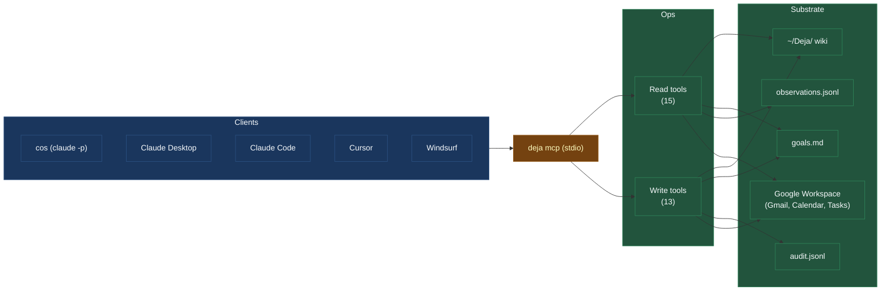

# MCP tool surface

Cos doesn't hard-code knowledge of Deja's internals. It talks to the rest of the system through an MCP server — a stdio process that exposes a tool catalog.

The same MCP server is auto-configured during setup into whatever AI clients you have installed: Claude Desktop, Claude Code, Cursor, Windsurf, VS Code. So the tools cos uses from inside Deja are also available to you from your normal editor, against the same wiki.



Every write tool logs a row to `audit.jsonl` with `trigger.kind=mcp`, so `deja trail` shows the call and the resulting mutation in one stream.

## Read tools

Cos uses these to assemble context before it writes anything.

### Briefing and search

| Tool | What it does |
| ---- | ------------ |
| `daily_briefing()` | One-shot: date, user profile, tasks, waiting-fors, reminders, active projects, recent observation narratives. The standard "what's going on right now" call. |
| `search_deja(query)` | BM25 across people, projects, events, conversations, plus a slice of goals.md. The go-to general-purpose lookup. |
| `get_page(category, slug)` | Full page read. `category` is `people`, `projects`, `events`, or `conversations`. |
| `get_context(topic)` | Hybrid retrieval bundle — user profile + QMD hybrid search + goals slice + last 60 min of observations. Heavier than `search_deja`; used when cos wants all the context for a topic in one call. |
| `list_goals()` | Raw goals.md grouped by section. |
| `search_events(query, days?, person?, project?)` | Event-only filtered search — useful when cos wants to know "what happened with this project last week." |
| `recent_activity(minutes)` | Observations from the last N minutes, keyword-filterable. |

### Ground truth — Google Workspace

When the local observation log might be stale or incomplete, cos goes straight to the source.

| Tool | What it does |
| ---- | ------------ |
| `calendar_list_events(time_min, time_max, ...)` | Google Calendar events, directly from the API. |
| `gmail_search(query)` | Gmail native search syntax (`from:`, `subject:`, `after:`, etc). |
| `gmail_get_message(id)` | Full message body by ID. |

### Reflect candidate generators

These are the four tools added during the reflect refactor. They replaced a set of narrow LLM sweeps (dedup-confirm, contradictions classification, events-to-projects proposal, goals-reconcile) with deterministic candidate generation plus cos's judgment.

| Tool | Returns | Cos decides |
| ---- | ------- | ----------- |
| `find_dedup_candidates(category, threshold, limit)` | Page pairs above a vector-similarity threshold | Whether they're the same entity; if so, merge via `update_wiki` |
| `find_orphan_event_clusters(min_size, sim_threshold)` | Event clusters that share people/projects and look parent-less | Whether to materialize a projects/ page |
| `find_open_loops_with_evidence(days, limit)` | Open tasks + waiting-fors paired with recent events that might resolve them | Whether the loop is closed, still open, or needs user attention |
| `find_contradictions(sim_min, sim_max, limit)` | Page pairs in the mid-similarity window — close enough to be about the same thing, far enough to possibly disagree | Which disposition (silent-fix / note in goals / email user) per the [contradiction escalation pattern](pipelines.md#cos-decides-what-to-do) |

Cos can also call `browser_ask` to query recent browsing when it's trying to ground a question.

## Write tools

### Wiki writes

```text
update_wiki(action, category, slug, content, reason)
```

One tool, four actions: `create`, `update`, `delete`, or the partial-merge variant used by dedup. Every write is a git commit. The `reason` parameter is load-bearing — it shows up in the commit message and in `audit.jsonl`, and cos learns to explain itself clearly because future cos cycles read those reasons.

### Goals and loops

| Tool | Effect |
| ---- | ------ |
| `add_task(title, due?, project?)` | Append a task to goals.md ## Tasks |
| `complete_task(task_id)` | Mark a task `[x]` with timestamp |
| `archive_task(task_id)` | Move to ## Archive |
| `add_waiting_for(title, from?, due?)` | Append to ## Waiting for (21-day auto-expire) |
| `resolve_waiting_for(id)` | Resolve and archive |
| `archive_waiting_for(id)` | Archive without resolution |
| `add_reminder(date, topic, question)` | Date-keyed nudge |
| `resolve_reminder(id)` | Resolve and archive |
| `archive_reminder(id)` | Archive without resolution |

### Actions that reach the outside world

```text
execute_action(type, params, reason)
```

Routes to a specific executor by `type`:

| Type | Params | Side effect |
| ---- | ------ | ----------- |
| `calendar_create` | `summary, start, end, location?, description?, kind?` | Google Calendar insert. `kind` is `firm` (default), `reminder` (auto-prefixes `[Deja] `, popup), or `question` (auto-prefixes `[Deja] ❓ `). Dedupes on title within ±1h. |
| `calendar_update` | `event_id, ...` | Modifies an existing event. |
| `draft_email` | `to, subject, body` | Creates a Gmail **draft**. Never sends to third parties. |
| `send_email_to_self` | `subject, body, in_reply_to?, thread_id?` | Immediate send to your own address. Auto-prefixes `[Deja] ` if missing. Threading params enable in-thread replies for the user-reply channel. |
| `create_task` | `title, ...` | Google Tasks API insert. |
| `complete_task` | `task_id` | Google Tasks completion. |
| `notify` | `title, message` | Writes `~/.deja/notification.json`; Swift app polls and shows. |

Three things to notice:

1. **Nothing sends email to third parties automatically.** `draft_email` creates a draft you review and send. `send_email_to_self` only sends to you.
2. **Calendar dedupes.** If cos tries to create an event with the same title within an hour of an existing one, it's deduped.
3. **Voice-dispatched actions are reversible.** When a voice command triggers an action, the executor records an artifact (`calendar_event` ID, `goal_line` position). For 15 seconds server-side (5 seconds in the UI), you can hit **undo** and the action is reversed.

## The MCP config cos uses

Cos's MCP client config lives at `~/.deja/chief_of_staff/mcp_config.json`. It points at `python -m deja mcp` — the same entry point your other AI clients use.

```json
{
  "mcpServers": {
    "deja": {
      "command": "/absolute/path/to/venv/bin/python",
      "args": ["-m", "deja", "mcp"]
    }
  }
}
```

The absolute path matters: cos runs outside the user's shell, so `python` from `PATH` won't resolve. `mcp_install.py` auto-writes this config into Claude Desktop, Claude Code, Cursor, and Windsurf during setup.

## Extending the surface

Want to add a new MCP tool? Three places to touch:

1. **`mcp_server.py`** — add a handler, register in the tool list.
2. **The read/write whitelist** in `integrate_claude_vision.py` and `chief_of_staff.py` — reads and writes are gated separately so integrate can't accidentally call a tool that should be cos-only.
3. **The ARCHITECTURE doc** — the `§9` tool table is load-bearing for anyone navigating the codebase.

If the new tool is a judgment helper (e.g. "cluster these events and pick the best title"), strongly consider splitting it: a deterministic candidate generator as the tool, cos as the decider.
