# The three pipelines

Deja's monitor process runs three loops on three different cadences. They share the same storage substrate, so a signal picked up at 3 seconds becomes a wiki update at 5 minutes and a reflection candidate at sunset.

```text
OBSERVE ────────▶  every 3 seconds
                   tail every source, dedupe, tier, persist
                                │
                                ▼
INTEGRATE ──────▶  every 5 minutes
                   read new signals + wiki context
                   → LLM → wiki writes + events + tasks + narrative
                                │
                                ▼
REFLECT ────────▶  3× per day (02:00 · 11:00 · 18:00 local)
                   deterministic prep
                   → cos reflective pass → cleanup + escalation
```

Each one is cheap on its own — the work compounds because they share the wiki.

## Observe — every 3 seconds

The observe loop is a polite poller. Every three seconds it walks a list of sources and asks each "anything new since last time?" Nothing heavy happens here: no LLM calls in the common path, no decisions about meaning, just **detect, dedupe, tier, persist**.

```mermaid
flowchart LR
    subgraph Sources
        M[iMessage]
        W[WhatsApp]
        E[Email]
        S[Screenshots]
        C[Calendar]
        D[Drive]
        B[Browser]
        CL[Clipboard]
        T[Typed text]
        V[Voice]
    end

    Sources --> Collect["Observer.collect()<br/>per-source"]
    Collect --> Dedupe["Dedupe by id_key"]
    Dedupe --> Tier["Tier T1 / T2 / T3"]
    Tier --> Persist["observations.jsonl<br/>(append-only)"]

    classDef src fill:#1a365d,stroke:#2c5282,color:#f7fafc
    classDef op fill:#22543d,stroke:#2f855a,color:#f7fafc
    class Sources,M,W,E,S,C,D,B,CL,T,V src
    class Collect,Dedupe,Tier,Persist op
```



A few details that matter in practice:

- **Cadences vary.** iMessage and clipboard are checked every cycle. Email, calendar and drive are every 6 seconds. Browser is every 9 seconds. Screenshots are event-driven — app focus change, typing pause, window change, or a 60-second passive floor.
- **Thread context is reconstructed.** For iMessage and WhatsApp, the last 30 messages in the thread get attached to each new observation so downstream LLMs can understand "ok" without guessing.
- **Screenshots go to integrate as raw pixels, not OCR text.** Integrate sends each screenshot's PNG directly to Claude Opus via the Anthropic multimodal API. Claude reads the pixels — window layout, focused-vs-inbox-preview distinction, calendar-cell grid position, bold/gray emphasis — without losing signal to an OCR intermediate. Apple's Vision framework still runs on every capture and writes the recognized text to `~/.deja/raw_ocr/<id>.txt` as a debugging sidecar, but the PNG is what integrate sees. See [signal sources](signals.md#screenshots) for details.

### Tiering

Every signal gets a tier label from a pure function (`classify_tier`):

| Tier | Means | Examples |
| ---- | ----- | -------- |
| **T1** | User-authored, or inbound from inner circle | Your sent email; messages from people marked as inner-circle |
| **T2** | Focused attention | Active threads, current calendar context, inbound mail from close contacts |
| **T3** | Ambient / background | Passive browser tabs, automation emails, random OCR noise |

Integrate always keeps T1 and T2. It drops T3-only message batches — that's where most of the noise filtering happens. Tiering is deterministic; it has no LLM in the loop.

The output of this whole pipeline is one append-only file: `~/.deja/observations.jsonl`. That file is the input to the next stage.

## Integrate — every 5 minutes

Integrate is where raw observations become durable wiki content. It fires on a timer — or immediately, when a voice command or notch chat writes `~/.deja/integrate_trigger.json`.

```mermaid
sequenceDiagram
    participant Loop as AnalysisCycle
    participant Obs as observations.jsonl
    participant Wiki as ~/Deja wiki
    participant LLM as Integrate LLM
    participant Cos as cos (cycle mode)

    Loop->>Obs: read from last offset
    Loop->>Loop: triage (T1/T2/T3) + filter stale screenshots
    Loop->>Wiki: rebuild index.md
    Loop->>Wiki: retrieve context (BM25 + vector + profile)
    Loop->>LLM: signals + wiki context + goals.md
    LLM-->>Loop: wiki_updates, goal_actions, tasks_update, narrative
    Loop->>Wiki: apply writes (git commit per batch)
    Loop->>Obs: advance offset
    Loop->>Cos: fire if cycle was substantive
```

What integrate does, step by step:

1. **Read fresh signals** from `observations.jsonl` since the last byte offset.
2. **Filter stale screenshots** (>30 min old). A prior bug silently dropped every screenshot for six days because a timestamp comparison crossed timezones. There's now an explicit guard.
3. **Triage** via tier.
4. **Rebuild `index.md`** — the wiki's top-level catalog. Fast, deterministic, 100–500 ms. The ordering (most-recently-touched first) is load-bearing: three different downstream readers truncate to it.
5. **Retrieve wiki context.** Hybrid BM25 over entity tokens plus QMD vector search, always including `index.md`.
6. **Call the integrate LLM** with: formatted signals, retrieved wiki slice, `goals.md`, current time, contacts summary.
7. **Parse + apply** the JSON output: wiki writes, goal actions, task mutations.
8. **Fire cos** if the cycle was substantive (not just "user typed three letters").

The integrate LLM is Claude Opus with multimodal screenshot inputs, invoked via the `claude` CLI so the whole backend runs on the user's Pro/Max subscription — no separate API key.

### What the LLM emits

A single JSON object, applied in order:

```json
{
  "observation_narrative": "one-line lead + bulleted threads",
  "reasoning": "one paragraph",
  "wiki_updates": [
    {
      "category": "people|projects|events",
      "slug": "...",
      "action": "create|update|delete",
      "body_markdown": "...",
      "event_metadata": { "date": "...", "people": [...] },
      "reason": "..."
    }
  ],
  "goal_actions": [{ "type": "calendar_create", "params": {...}, "reason": "..." }],
  "tasks_update": { "add_tasks": [...], "complete_tasks": [...] }
}
```

The integrate prompt is ~200 lines of rules. The load-bearing ones include: only write what signals actually say, never promote OCR names to person pages without structured grounding (email / phone / chat label / existing back-reference), never overwrite prose without a concrete new fact, promote durable facts to the entity body.

## Reflect — three times a day

Reflect is Deja's cleanup and reconciliation pass. It runs at 02:00, 11:00, and 18:00 local (configurable). Sleep-safe: if your machine was shut during a slot, the next wake runs the pass once, no stampede.

Reflect used to be a sequence of narrow LLM sweeps — "Flash, classify these for dedup"; "Flash, decide whether this contradicts that"; "Flash, propose a project from these orphan events." Each sweep was cheap, each had its own false-positive class, and the result was brittle.

The new shape is simpler: **deterministic prep, then one pass by cos with tools.**

```mermaid
flowchart LR
    subgraph Prep["Deterministic prep (no LLM)"]
        V[Refresh vector<br/>embeddings]
        C1[find_dedup_candidates]
        C2[find_orphan_event_clusters]
        C3[find_open_loops_with_evidence]
        C4[find_contradictions]
        A[audit.jsonl trim >7d]
    end

    subgraph CosPass["Cos reflective invocation"]
        CP["claude -p<br/>+ MCP"]
    end

    subgraph Writes
        WK[wiki updates]
        GL[goals.md notes]
        EM["[Deja] email<br/>only if needed"]
    end

    Prep --> CosPass
    CosPass --> Writes

    classDef prep fill:#1a365d,stroke:#2c5282,color:#f7fafc
    classDef cos fill:#744210,stroke:#975a16,color:#fefcbf
    classDef wr fill:#22543d,stroke:#2f855a,color:#f7fafc
    class Prep,V,C1,C2,C3,C4,A prep
    class CosPass,CP cos
    class Writes,WK,GL,EM wr
```



### Deterministic prep

No LLM calls in this phase. It's pure:

- **Refresh QMD vector embeddings** over people, projects, and event pages.
- **Pre-compute candidate sets** cos is likely to want — recent activity windows, open loops, slugs touched since the last reflect.
- **Trim the audit log** (drop rows older than 7 days).

If cos doesn't ask for a single candidate set this slot, the whole prep bill is a few hundred vector ops.

### Cos decides what to do

Then a single `invoke_reflective_sync()` call. Cos reads its system prompt plus a reflective appendix, sees the slot (02/11/18) and horizon, and decides what to look into. It has four candidate-generator tools on top of its usual reads and writes:

- `find_dedup_candidates(category, threshold, limit)` — high-similarity page pairs. Cos reads both and decides if they're the same entity.
- `find_orphan_event_clusters(min_size, sim_threshold)` — event clusters that might want a parent project page.
- `find_open_loops_with_evidence(days, limit)` — open tasks and waiting-fors paired with recent events that might resolve them.
- `find_contradictions(sim_min, sim_max, limit)` — page pairs that look close but might disagree on a fact.

When cos finds a contradiction, it picks one of three dispositions:

1. **Resolvable via tools** — silently fix via `update_wiki` with the evidence in the reason. A calendar or Gmail lookup can often settle a date mismatch.
2. **Unresolvable but not blocking** — note both claims in `goals.md` with the tool evidence. Future cos cycles may get new signal and can revisit.
3. **Blocking a critical fact** — ask the user via `send_email_to_self`. Just the question and the two claims. The reply routes back through the [user-reply channel](cos.md#user-reply) and cos resolves the write.

This pattern — fix silently if you can, write to goals if you can't, email only when you genuinely need the human — is the general shape of cos's judgment in reflect.

## Why three tiers at all

You could build a single every-minute loop that does everything. It would be simpler and much worse:

- **Observe has to be cheap** or it can't be frequent. 3s polling demands zero LLM calls in the hot path.
- **Integrate has to be bounded.** Its job is to assimilate a small batch into the wiki with a tight prompt. One focused LLM call per batch is the right budget.
- **Reflect has to be wide.** Looking for duplicates, contradictions, stale loops requires whole-wiki context — you can't afford that every 5 minutes, and you don't need it.

Three cadences, three budgets, one shared substrate. The next section shows the substrate.
