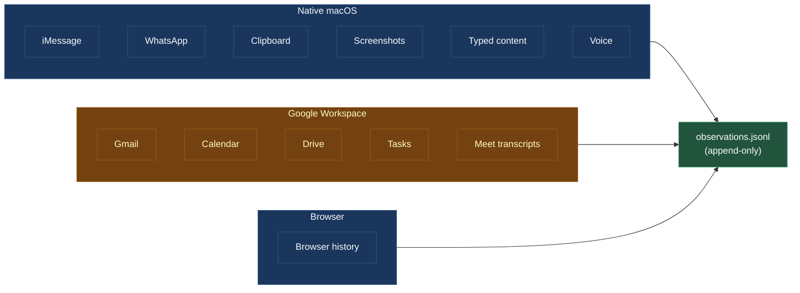
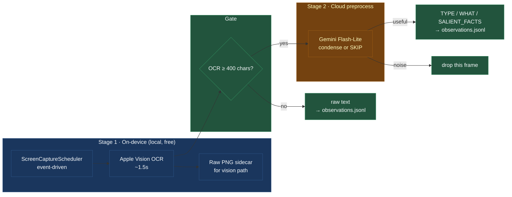
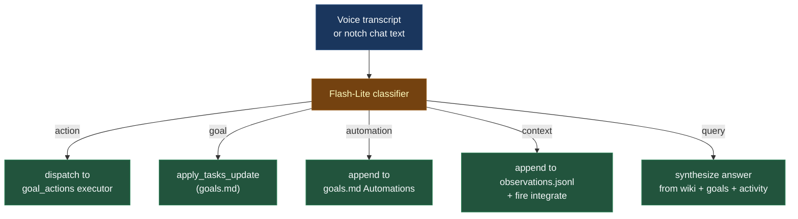

# Signal sources

Deja watches about ten signal streams. Each one has its own quirks — how it's fetched, how it's deduped, how often, and what can go wrong. This page is a tour.

All sources share one output: append a row to `observations.jsonl`. All sources share the same tiering system (T1/T2/T3, see [pipelines](pipelines.md#tiering)). What differs is how each one finds new material.

## Messages — iMessage and WhatsApp

Both read from local SQLite databases: `~/Library/Messages/chat.db` for iMessage, the WhatsApp desktop app's store for WhatsApp.

- **Cadence**: every 3-second cycle.
- **Dedupe**: per-message `id_key` (e.g. `chat<chat_id>-<message_rowid>`).
- **Contact resolution**: phone numbers and Apple IDs are matched against the macOS Contacts database to resolve display names.
- **Thread context**: when a new message lands, the formatter walks backward through `observations.jsonl` and attaches the last 30 messages in the same thread. That way the integrate LLM can understand a terse "ok" or "sounds good" without guessing.
- **Self-addressed messages** are a first-class channel. If you message yourself with `[Deja]` in the text, it routes to cos as a user-reply (same path as email replies).

Permissions required: Full Disk Access for the Deja app and its bundled Python binary (macOS doesn't let you read the Messages database without it).

## Email

Gmail via the Google Workspace API, incremental sync by `historyId`.

- **Cadence**: every ~6 seconds (every 2nd observe cycle).
- **Outbound** (sent by you) are T1 — always kept.
- **Inbound** go through the tiering function: close contacts → T2, automation / bulk → T3.
- **Self-emails with `[Deja]` subject** are inspected closely. A subject starting with `Re: [Deja]` routes to cos as a user reply. A subject without `Re:` is dropped — cos's own outbound, not a user message.
- **Anti-spoofing on reply detection** is strict: exact `From` match to the authenticated Google identity, plus a DMARC pass in `Authentication-Results`.

## Calendar

Google Calendar via incremental sync tokens.

- **Cadence**: every ~6 seconds.
- Captures events created, modified, or deleted since the last sync.
- Calendar is also readable live via MCP `calendar_list_events` — cos uses the API directly when it wants authoritative ground truth rather than the local observation log.

## Drive and Tasks

Same pattern: polled every ~6 seconds, delta-synced, tiering applied. Drive file opens and edits feed project context. Tasks (Google Tasks) is one of the write targets for `create_task` / `complete_task` MCP tools.

## Browser

A local history reader (SQLite again — Chrome/Arc/Safari depending on what's installed). Polled every ~9 seconds.

- Mostly T3 (ambient). A few domain patterns get promoted — a jobs board on an active job search, a project's GitHub org, etc.
- The current interface is passive. An `browser_ask` MCP tool lets cos query recent browsing when it's trying to ground a question ("what were you just reading about?").

## Clipboard

Polled every cycle for text copy events. Useful for catching "I just pasted this phone number from my calendar into my messages app" moments.

## Typed content

A typing-pause detector on focused text fields. When you stop typing for about 2 seconds in an input, Deja snapshots the current content. Particularly useful for catching long email drafts or chat messages before you send them.

## Screenshots {: #screenshots }

The only source with serious post-processing. Two stages, both designed to avoid noise in the wiki.

### Capture is event-driven

The old captor ran on a fixed 6-second timer and caught about **14,000 frames a day**. Most were redundant. The new scheduler is event-driven: app focus change, typing pause (≥2s), accessibility window-change notification, or a 60-second passive floor. Result: about **1,000 frames a day**, each marking an actual state transition.

### OCR first, always

Apple Vision OCR runs on every capture — fast, on-device, free. The text is saved to `~/.deja/raw_ocr/<date>/<id>.txt` before any further processing. The raw PNG is saved to `~/.deja/raw_images/<date>/<id>.png` so the Claude Vision path (which reads pixels, not OCR text) has the original.

### Preprocess gates integrate's input

If OCR yields fewer than 400 characters, the frame goes straight to integrate — probably not a lot of content to summarize. If it's above 400 characters, Gemini Flash-Lite is asked to do one of two things:

1. Return a compact `TYPE / WHAT / SALIENT_FACTS` block (tells integrate what to care about).
2. Return `None` — signaling "this is noise, skip it entirely."

Skipped frames don't go to `observations.jsonl`. This is the single highest-leverage noise filter in the whole pipeline.

## Voice

Push-to-talk via holding the Option (⌥) key. Capture happens in the Swift process (one TCC mic entry, `com.deja.app`). On release:

1. Groq Whisper transcribes via the LLM proxy.
2. Groq `llama-3.1-8b-instant` polishes — strips fillers, fixes spoken symbols ("comma" → `,`), preserves word choice.
3. Hard-coded filter drops known Whisper hallucinations on near-silent audio ("you", "thanks", "bye").
4. The polished transcript goes to cos's command classifier (see below).

You can also type into the notch panel — same pipeline from the classifier onward.

## Voice and chat — how commands are routed

Voice and chat go through a single Flash-Lite classifier that picks one of five types:

| Type | Example | Dispatched to |
| ---- | ------- | ------------- |
| `action` | "put dentist on my calendar tomorrow 3pm" | goal_actions executor |
| `goal` | "remind me to reply to Jane" | apply_tasks_update in goals.md |
| `automation` | "when <co-parent> emails about pickup, auto-draft a reply" | appended to goals.md ## Automations |
| `context` | "note that the coach said the team plays at 11am next Saturday" | appended to observations.jsonl + integrate fires |
| `query` | "what did Jane say about the casita quote?" | synthesized answer from wiki + goals + activity |

On response, a brief echo pill shows at the top of the screen: the transcript with a badge emoji by classification type, a one-line confirmation, and — for reversible actions — an **undo button** active for 5 seconds.

## Why all of this is worth the code

Having many sources lets Deja stay quiet in a different way: it can **cross-reference**. A calendar event on Friday + an iMessage on Thursday + a Gmail thread on Wednesday might be three pieces of the same project. Flash-Lite won't notice; cos, with the wiki as substrate and MCP as its hands, often will.

The whole thing only works because of the shared observations log and the wiki. Every source is just another small feeder into the substrate described in [the wiki](wiki.md).
