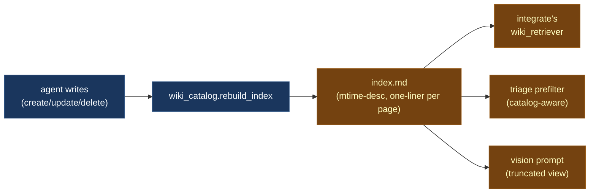

# The wiki

Deja's memory is a folder of Markdown files, committed to a local git repo, browsable in Obsidian. That's it.

This choice carries most of the design. Every other decision — how cos reasons, how integrate writes, how the MCP tool surface looks — falls out of "the wiki is the source of truth and it has to stay legible to a human."

## Layout

```text
~/Deja/
├── index.md                      # auto-generated catalog, sorted by mtime
├── goals.md                      # tasks, waiting-fors, reminders, standing context
├── log.md                        # human-readable activity log
├── reflection.md                 # daily synthesis (morning note)
├── people/<slug>.md              # one page per person
├── projects/<slug>.md            # one page per ongoing project
├── events/YYYY-MM-DD/<slug>.md   # timestamped events with YAML frontmatter
├── observations/YYYY-MM-DD.md    # daily narrative log
├── conversations/YYYY-MM-DD/<slug>.md   # per-thread user↔cos dialogues
├── prompts/                      # editable LLM prompts
└── .git/                         # every agent write is a commit
```

There are only three durable categories: **people**, **projects**, **events**. Everything else in the wiki is either an index (`index.md`, `log.md`), a ledger (`goals.md`), or session material (`conversations/`, `observations/`).

## The three categories

| Category | Describes | Example slug |
| -------- | --------- | ------------ |
| `people/` | A person — who they are, what's true about them now | `jane-pm` |
| `projects/` | A project, thread, or life arc — what it is, where it stands | `office-relocation` |
| `events/<date>/` | Something that happened — timestamped, entity-linked | `2026-04-18/jane-pm-accepted-offer` |

**Entity pages** (people, projects) are short prose — 100–400 words, present tense, leading with what's true right now. They're not a journal. When a new fact lands, the integrate LLM either updates the page body (if the fact is durable) or drops a line in the `## Recent` section with a wiki-link to the event page.

**Event pages** are the journal. They're short, they have YAML frontmatter for structured linking, and they get materialized from concrete signals (an email, a calendar event, an iMessage that resolves a loop). Example:

```yaml
---
date: 2026-04-18
time: "11:01"
people: [jane-pm, joe-partner]
projects: [office-relocation]
---

Jane confirmed the new Pier 39 address over iMessage. Lease starts May 1.
Joe is handling the move coordinator call tomorrow at 3pm.
```

You don't write that frontmatter by hand. The integrate LLM emits a structured `event_metadata` field and the wiki writer serializes it into YAML.

## Why Markdown and git

Because every AI system eventually gets something wrong, and when it does, you want to:

1. **See** what it wrote. Markdown is legible. A JSON blob in a database is not.
2. **Diff** it against what it knew before. Git does this for free.
3. **Revert** individual mistakes without losing good work. `git revert <sha>`.
4. **Trust** the local copy. Plain files are hard to lose. A corrupted SQLite file is catastrophic; a broken Markdown file is annoying.

There's a secondary benefit: Obsidian. You can open `~/Deja/` in Obsidian, edit pages by hand, follow `[[wiki-links]]`, and the next agent cycle sees your edits. The wiki is yours, not the agent's.

## `index.md` is load-bearing

After every wiki write, a pure-Python function rebuilds `index.md`: a flat list of every page, newest-first by mtime, with a one-line summary.



Three different consumers read `index.md` top-down within an attention budget. The ordering is not cosmetic — it directly decides what each downstream LLM sees first. If you touch a page, it jumps to the top, and the next integrate cycle sees it before older stuff. This is the cheapest and most effective recency signal in the system.

!!! tip "Don't 'normalize' this"
    If you read the code and think "I could sort `index.md` alphabetically," don't. The mtime ordering is load-bearing in three places.

## `goals.md` — the working ledger

`goals.md` is the bridge between your intent and the agent's behavior. It's editable in Obsidian, read every cycle by the agent, and written by the agent in narrow ways.

Six sections:

| Section | Who writes | Purpose |
| ------- | ---------- | ------- |
| **Standing context** | You | Durable facts — schedules, relationships, priorities |
| **Automations** | You | Trigger→action rules the agent executes ("TeamSnap email → calendar event") |
| **Tasks** | Agent | Commitments you made, extracted from outbound messages |
| **Waiting for** | Agent | Things others owe you (21-day auto-expire) |
| **Reminders** | Agent | Date-keyed nudges |
| **Archive** | Agent | Resolved items with timestamps and reasons |

Cos uses `goals.md` as its scratchpad. Its disposition is "**add to goals.md rather than email**" for anything non-urgent. Future cos cycles read `goals.md` and decide *when* (or whether) to actually surface each item. A sports-practice schedule change noted at 3 PM on Friday doesn't need to wake you up — cos can plant it and surface it during Monday morning's briefing if it's still relevant.

## Rules the integrate LLM follows

The integrate prompt is ~200 lines. A few rules are load-bearing:

- **Only write what signals say.** Inference is fine; fabrication is not.
- **Deletion requires explicit user retraction.** Agents don't remove facts just because they're old.
- **Person pages require structured grounding.** A name in screenshot OCR alone isn't enough — there must be an email, phone, chat label, or an existing `[[slug]]` reference somewhere.
- **Update-without-new-fact is banned.** If there's no concrete new information, don't rewrite the page.
- **Durable facts get promoted to the entity body.** A one-off event ("Jane mentioned she's moving") becomes a standing fact ("Jane is relocating to Pier 39 office in May").

These rules exist because earlier versions of the agent had fun writing speculative prose. That made the wiki less trustworthy, which made cos's downstream decisions less trustworthy, which was exactly the wrong direction.

## The state directory

The wiki lives at `~/Deja/`. Deja's operational state lives separately at `~/.deja/` — observations, audit trail, PID files, sockets, buffers, configuration. It's not meant to be human-legible; it's where the pipelines checkpoint and buffer. A short tour:

| File | Purpose |
| ---- | ------- |
| `observations.jsonl` | Append-only log of every raw signal |
| `audit.jsonl` | Every state mutation with reason + trigger |
| `config.yaml` | User config — feature flags, slot hours, model choices |
| `last_integration_offset` | Byte offset into observations.jsonl; resumption mark |
| `chief_of_staff/` | Cos config + invocation log |
| `raw_ocr/<date>/<id>.txt` | Apple Vision OCR text for screenshots |
| `raw_images/<date>/<id>.png` | Raw screenshot PNGs |
| `deja.sock` | Unix socket FastAPI listens on |

You can poke at this stuff if you're debugging (`deja trail`, `deja status`), but the day-to-day surface is the wiki.

## The mental shortcut

If you remember one thing about storage: **the wiki is the input to every agent decision**, and every agent decision is a **commit** to the wiki. Everything else (observations, audit, buffers) supports that loop.
